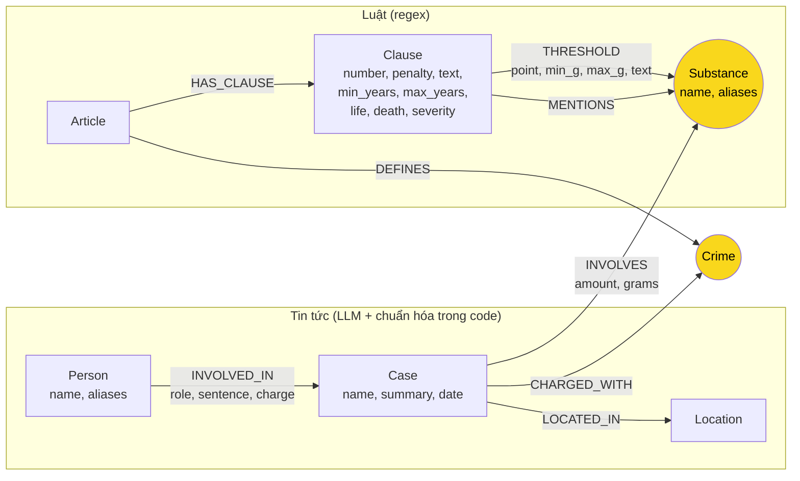

# Thiết kế Ontology — Day 19

**Họ tên:** Lê Chí Hùng  **MSSV:** 2A202602863

**Lựa chọn** (đánh dấu một):
- [ ] Dùng ontology gợi ý (có thể chỉnh nhỏ)
- [x] Tự thiết kế (xét bonus +15, xem `SUBMISSION.md`)

> Cách làm: chạy ontology gợi ý trước (tag git `hint-ontology`, kết quả `ket_qua_benchmark_kg.hint.txt`), soi lỗi bằng Cypher (`report/evidence/hint_graph.md`), rồi chỉ thay đổi những chỗ có lỗi chứng minh được. Graph sau thay đổi: `report/evidence/own_graph.md`. Đặt `KG_ONTOLOGY=suggested` để dựng lại ontology gợi ý từ cùng một code.

## 1. Sơ đồ

Node cầu nối: **`Crime`** (cầu chính, nối vụ án với Điều luật) và **`Substance`** (cầu phụ, nối lượng chất của vụ án với khoản luật thông qua ngưỡng khối lượng).

## 2. Entity types (node labels)

| Label | Ý nghĩa | Khóa định danh (`MERGE` theo) | Properties | Lấy từ KB nào | Trích bằng |
| --- | --- | --- | --- | --- | --- |
| `Article` | Một Điều luật | `id` (`"Điều 251 BLHS"`) | `title`, `law`, `doc_id` | Luật | Front matter + regex |
| `Clause` | Một khoản của Điều | `id` (`"Điều 251 BLHS khoản 4"`) | `number`, `penalty`, `text`, `doc_id`, **`min_years`, `max_years`, `life`, `death`, `severity`** | Luật | Regex (`CLAUSE_START`, `parse_penalty`) |
| `Crime` | Tội danh chuẩn (cầu nối) | `name` đã chuẩn hóa (`normalize_crime`) | | Luật (tiêu đề Điều) | Regex; tội từ tin được `link_entity` map về đây |
| `Substance` | Chất ma túy **chuẩn** (cầu nối phụ) | `name` chuẩn (`canonical_substance`) | **`aliases`** | Cả hai | Luật: `find_substances`; Tin: LLM → `canonical_substance` |
| `Case` | Một vụ việc trong một bài báo | `name` (do LLM đặt) | `summary`, `date`, `doc_id`, `source_title` | Tin | LLM |
| `Person` | Người trong vụ việc | `name` | `aliases` (biệt danh) | Tin | LLM |
| `Location` | Tỉnh/thành | `name` | | Tin | LLM |

`severity` là số dùng để xếp hạng mức phạt: tử hình = 30, chung thân = 25, các trường hợp khác bằng `max_years`, không có phạt tù = 0.

Node `Substance` đặc biệt `"chất ma túy khác (thể rắn)"` đại diện cho điểm luật "Các chất ma túy khác ở thể rắn". Những chất không có tên trong luật, như Ketamine, được so ngưỡng theo nhóm này.

## 3. Relationships

| Type | Từ → Đến | Properties trên cạnh | Ý nghĩa |
| --- | --- | --- | --- |
| `DEFINES` | Article → Crime | | Điều luật định nghĩa tội |
| `HAS_CLAUSE` | Article → Clause | | Điều có khoản |
| **`THRESHOLD`** | Clause → Substance | `point`, `min_g`, `max_g` (gam; `null` = không giới hạn trên), `text` | Điểm `point` của khoản áp dụng khi khối lượng chất trong `[min_g, max_g)` |
| `MENTIONS` | Clause → Substance | | Khoản nhắc chất nhưng **không** có ngưỡng khối lượng (ví dụ Điều 247 tính theo số cây) |
| `CHARGED_WITH` | Case → Crime | | Vụ bị truy tố / xét xử về tội |
| `INVOLVES` | Case → Substance | `amount` (nguyên văn), **`grams`** (quy đổi, `null` nếu không quy đổi được) | Vụ liên quan chất, với khối lượng |
| `LOCATED_IN` | Case → Location | | Nơi xảy ra |
| `INVOLVED_IN` | Person → Case | `role`, `sentence`, `charge` | Vai trò và mức án của người trong vụ |

Đối chiếu với graph thật (`report/evidence/own_graph.md`): 7 label `Clause 99, Person 34, Article 18, Case 14, Crime 13, Substance 12, Location 7`; 8 loại cạnh `THRESHOLD 243, HAS_CLAUSE 99, INVOLVED_IN 42, CHARGED_WITH 20, INVOLVES 18, LOCATED_IN 14, DEFINES 13, MENTIONS 7`.

## 4. Node cầu nối giữa 2 KB

- **Node nào:** `Crime` là cầu chính. `Substance` là cầu phụ, chỉ dùng để chọn khoản sau khi đã qua `Crime` tới Điều.
- **Vì sao chọn node này:** tội danh là thứ duy nhất **cả hai KB đều gọi tên**: tiêu đề Điều luật ("Tội mua bán trái phép chất ma túy") và bài báo ("bị tuyên … về tội mua bán trái phép chất ma túy"). Số Điều thì báo hầu như không ghi. Chất ma túy cũng xuất hiện ở cả hai phía, nhưng một chất có trong nhiều Điều, nên nếu dùng nó làm cầu chính sẽ nối nhầm. Vì vậy chất chỉ được dùng **sau** khi đã xác định được Điều, để chọn khoản.
- **Cách đảm bảo hai phía khớp tên:**
  - Tội danh: đưa danh sách 13 tội chuẩn vào prompt trích xuất. Kết quả LLM vẫn đi qua `link_entity` (chuẩn hóa chữ hoa, tiền tố "Tội", dùng `difflib` với cutoff 0.8), và không đủ giống thì bỏ, không đoán.
  - Chất: dùng `canonical_substance`. Hàm này dùng bảng `SUBSTANCE_ALIASES` (thuốc lắc → MDMA, ma túy đá → Methamphetamine, ketamin → Ketamine…), so khớp không phân biệt chữ hoa/thường với `SUBSTANCES`, và **bỏ** tên chung chung ("ma túy", "chất ma túy", "ma túy tổng hợp").
- **Khi nào cầu gãy, và xử lý thế nào:**
  - Tội nằm ngoài Chương XX. Ví dụ vụ An Giang là tội "chống người thi hành công vụ", nên `link_entity` trả `None` và vụ không có `CHARGED_WITH`. Đây là gãy **hợp lý**: KB luật không có Điều này.
  - LLM ghi tội lệch quá xa tên chuẩn (dưới cutoff) thì bị bỏ. Chấp nhận mất cạnh để tránh nối sai.
  - Khối lượng không quy đổi được ra gam ("5 viên", "hơn 1.000 đầu pod") làm gãy cầu phụ. Khi đó `context()` ghi rõ *"chưa xác định được khoản theo khối lượng"* và **vẫn** trả khung cơ bản và khung cao nhất của Điều, nên LLM không mất căn cứ pháp lý.

## 5. Competency questions

| Câu | Đường đi (Cypher pattern) | Trả lời được? |
| --- | --- | --- |
| Q1 | `(:Article {id:'Điều 2 Luật PCMT'})-[:HAS_CLAUSE]->(:Clause {number:4})` → đọc `text` | **Một phần.** Graph có text khoản 4 ("Tiền chất là…"), nhưng ontology không có entity "khái niệm". `context()` chỉ mở khoản khi câu hỏi nêu số Điều, nên câu này thực tế được trả lời nhờ chunk vector. Chấp nhận vì đây là câu single-hop mà Flat RAG đã làm tốt. |
| Q2 | `(p:Person)-[r:INVOLVED_IN]->(k:Case) WHERE k.name CONTAINS '36kg' AND r.sentence = 'tử hình' RETURN p.name` | Có |
| Q3 | `(:Person {name:'Lê Minh Thành'})-[:INVOLVED_IN {sentence}]->(:Case)-[:CHARGED_WITH]->(:Crime)<-[:DEFINES]-(:Article)-[:HAS_CLAUSE]->(:Clause {number:1})` | Có |
| Q4 | `(p:Person)-[:INVOLVED_IN {charge}]->(:Case)-[:CHARGED_WITH]->(:Crime)<-[:DEFINES]-(a:Article)-[:HAS_CLAUSE]->(cl:Clause) WHERE 'Hoàng Nato' IN p.aliases RETURN a.id, cl ORDER BY cl.severity DESC LIMIT 1` | **Có** (ontology gợi ý: **không**, xem mục 7) |
| Q5 | `(:Person {name:'Cái Quang Huy'})-[:INVOLVED_IN]->(k:Case)-[i:INVOLVES]->(s:Substance)<-[t:THRESHOLD]-(cl:Clause)<-[:HAS_CLAUSE]-(a:Article)-[:DEFINES]->(:Crime)<-[:CHARGED_WITH]-(k) WHERE t.min_g <= i.grams AND (t.max_g IS NULL OR i.grams < t.max_g)` → Điều 250 khoản 4 điểm b | **Có, trực tiếp từ graph** (ontology gợi ý: chỉ trả được danh sách khoản 1–4 để LLM tự chọn) |
| Q6 | `(s:Substance)<-[:INVOLVES]-(k:Case)<-[:INVOLVED_IN]-(p:Person) WHERE s.name = 'MDMA' OR 'mdma' IN s.aliases RETURN k.name, collect(p.name)` | Có, nhưng chỉ đầy đủ khi LLM trích được chất cho từng vụ. Trong lần chạy cuối, graph có đủ 3 vụ của đáp án và thêm vụ Hoàng Nato (thuốc lắc → MDMA). |

## 6. Quyết định thiết kế và đánh đổi

1. **Ngưỡng khối lượng là property trên cạnh `THRESHOLD`, không phải node riêng.**
   - Phương án khác: (a) giữ nguyên text khoản cho LLM tự đọc ngưỡng, như ontology gợi ý; (b) tạo node `Point` cho từng điểm a), b)… rồi nối `Point → Substance`.
   - Chọn cạnh vì so ngưỡng chỉ tốn 1 bước, không thêm hàng trăm node, và Cypher lọc `min_g <= grams < max_g` được ngay.
   - Đánh đổi: các điều kiện không phải khối lượng ("Có tổ chức", "Qua biên giới") không được mô hình hóa. Đó là phần (b) làm được mà thiết kế này không làm được.
2. **Quy đổi khối lượng ra gam bằng regex trong code, không nhờ LLM.**
   - Phương án khác: thêm trường `grams` vào prompt trích xuất.
   - Chọn regex vì nó tất định, không tốn token, chạy lại không đổi, và kiểm thử được (`parse_grams("hơn 9,6kg") = 9600`).
   - Đánh đổi: đơn vị đếm ("viên", "gói", "đầu pod") không quy đổi được. Graph ghi `grams = null` và nói rõ điều đó trong context thay vì đoán.
3. **Giữ `Crime` làm cầu chính, không nối thẳng `Case → Article`.**
   - Phương án khác: cho LLM chọn số Điều luôn khi trích xuất.
   - Báo chí gần như không ghi số Điều, nên LLM sẽ phải tự suy ra. Ghép tên tội với danh sách chuẩn thì kiểm soát được (`link_entity`, cutoff 0.8).
   - Đánh đổi: thêm 1 bước trên đường đi, và tội ngoài danh sách bị bỏ (E1).
4. **Mức phạt có cấu trúc (`max_years`, `life`, `death`, `severity`), và `context()` luôn lấy khung cao nhất của mỗi Điều.**
   - Phương án khác: lấy mọi khoản (đủ thông tin nhưng prompt dài), hoặc chỉ lấy khoản 1 và khoản nhắc chất (ontology gợi ý, thiếu khung tối đa).
   - Đánh đổi: thêm khoảng 1 dòng mỗi Điều, đổi lại trả lời được các câu hỏi "tối đa bao nhiêu".
5. **Mỗi khoản chỉ đưa vào prompt dòng tiêu đề (khung hình phạt) và đúng điểm khớp ngưỡng, không đưa cả khoản.**
   - Phương án khác: đưa nguyên `text` của khoản như ontology gợi ý.
   - Đánh đổi: tiết kiệm token (với Q3, phần căn cứ pháp lý chỉ còn 2 dòng là tiêu đề khoản 1 và khoản 4 của Điều 251, thay vì nguyên văn khoản 1–4), nhưng LLM không thấy các điểm khác của khoản. Các điểm này vẫn có thể có trong chunk vector.
6. **Giữ khóa `Case.name` do LLM đặt**, như ontology gợi ý. Thay đổi này đã cân nhắc nhưng chưa làm. Hệ quả là lỗi E3: một sự kiện được nhiều bài báo đưa tin thì thành nhiều node `Case` (mục 8).

## 7. So với ontology gợi ý (bắt buộc nếu xét bonus)

| Điểm khác | Gợi ý làm gì | Bạn làm gì | Vấn đề nó giải quyết | Bằng chứng (Cypher, hoặc số liệu benchmark) |
| --- | --- | --- | --- | --- |
| **Ngưỡng khối lượng** | `(Clause)-[:MENTIONS]->(Substance)` không kèm lượng; vụ `INVOLVES {amount}` dạng chuỗi | `(Clause)-[:THRESHOLD {point, min_g, max_g}]->(Substance)`, `INVOLVES {grams}`, nhóm "chất ma túy khác (thể rắn)" | Gợi ý chọn khoản theo *tên* chất. Vì khoản nào cũng nhắc MDMA nên lấy hết khoản 1–4 (lỗi E2, prompt dài, LLM phải tự đoán khoản) | **Trước** (`hint_graph.md`, `E2_clauses_per_case`): vụ "5 viên MDMA" → `clauses_selected=[2, 4, 3]`; vụ "0,686g MDMA" → `[3, 4, 2, 1]`. **Sau** (`own_graph.md`, `OWN_clause_by_amount`): `MDMA 9.6kg → Điều 250 khoản 4 điểm b`, `MDMA 0,686g → Điều 249 khoản 1 điểm c`, `Ketamine 406g → Điều 250 khoản 4 điểm e`; vụ "5 viên" không chọn khoản nào và nói rõ lý do. Q3: phần luật chỉ còn 2 dòng (tiêu đề khoản 1 và khoản 4) thay vì nguyên văn khoản 1–4. |
| **Mức phạt có cấu trúc + khung cao nhất** | `Clause.penalty` là chuỗi; `context()` lấy khoản 1 và khoản nhắc chất | `Clause {min_years, max_years, life, death, severity}`; `context()` thêm khoản có `severity` lớn nhất của mỗi Điều | Điều 255 không có khoản nào nhắc tên chất, nên gợi ý chỉ lấy được khoản 1 (07 năm) và trả lời sai câu "tối đa" | **Trước:** `E2_article255_clause_substances` → mọi khoản `substances=[]`. Q4 graph: *"phạt tù tối đa 07 năm theo Điều 255"*, recall 0.67, judge 1. **Sau:** `OWN_max_penalty_255` → `clause=4, life=True, severity=25` đứng đầu. Q4 graph: *"tối đa 20 năm hoặc tù chung thân theo Điều 255 BLHS khoản 4"*, recall 1.00, judge 2. |
| **Gộp tên chất đồng nghĩa** | `MERGE (:Substance {name})` theo chuỗi LLM trả về | `canonical_substance`: aliases, không phân biệt chữ hoa/thường, bỏ tên chung chung; `Substance.aliases` để `seed_facts` khớp cả tên lóng trong câu hỏi | Trùng node (E3) làm câu tổng hợp theo chất bị sót | **Trước** (`E3_substances`): 17 node gồm `Ketamine`/`ketamine`, `Methamphetamine`/`methamphetamine`, `thuốc lắc`, `ma túy`, `chất ma túy`, `ma túy tổng hợp`. **Sau:** 12 node, không trùng; `MDMA.aliases = ['thuốc lắc', 'ecstasy']`; số vụ nối với MDMA tăng từ 4 lên 5 (vụ Hoàng Nato có "thuốc lắc"). |

**Tổng hợp benchmark (Graph):** ontology gợi ý có recall/judge 0.94 / 1.67; ontology mới có 0.94 / **1.83**. Câu Q4 tăng từ judge 1 lên 2. Câu Q6 giảm recall từ 1.00 xuống 0.67 vì LLM bỏ sót tên dù graph có tên đó (`REPORT_KG.md`, lỗi E5). Chi phí mỗi câu: 0.00072 USD so với 0.00076 USD.

**Câu ontology gợi ý trả lời sai mà ontology mới trả lời đúng:**
- **Q4** (khung tối đa của Điều 255): gợi ý trả lời sai, ontology mới đúng.
- **Q5**: gợi ý chỉ đưa ra danh sách khoản để LLM tự chọn; ontology mới trả về đúng khoản 4 điểm b bằng chính Cypher của graph (bảng mục 5).

## 8. Hạn chế còn lại

- **Một sự kiện bị tách thành nhiều `Case` (E3).** Vụ bắt Hoàng Nato có 4 node `Case` từ 4 bài báo, vì khóa là tên do LLM đặt theo từng bài. Hướng sửa: đưa danh sách vụ đã có vào prompt để LLM dùng lại tên, hoặc tách `Report` (bài báo) khỏi `Case` (sự kiện) kèm cạnh `REPORTS {stage}` (bắt, khởi tố, xét xử). Đổi lại phải tốn thêm token mỗi bài và việc gộp nhầm cũng có rủi ro.
- **Ngưỡng của `cần sa` và `thuốc phiện` bị mơ hồ.** Luật tách nhựa / lá / quả với các ngưỡng khác nhau, trong khi graph chỉ có một node cho mỗi chất. Cạnh `THRESHOLD.text` giữ nguyên văn điểm luật để LLM phân biệt.
- Chất ở thể lỏng (ngưỡng tính theo mililít) và đơn vị đếm ("viên", "đầu pod") không quy đổi được.
- Các điều kiện tăng nặng không phải khối lượng ("Có tổ chức", "Qua biên giới", "Tái phạm nguy hiểm") không được mô hình hóa.
- **Thuộc tính rỗng hoặc rác do prompt trích xuất (E6).** 7 cạnh `INVOLVED_IN` có `sentence = 'chuỗi rỗng'` (LLM chép nguyên văn từ hướng dẫn trong prompt) và 5 cạnh có `'không rõ'`.
- Không phân biệt giai đoạn tố tụng (bắt, khởi tố, sơ thẩm, phúc thẩm).
